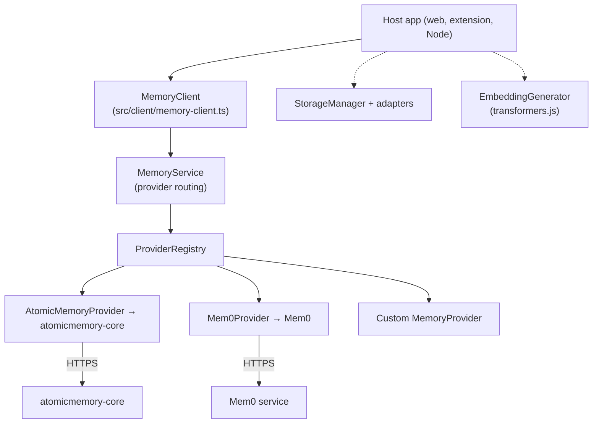
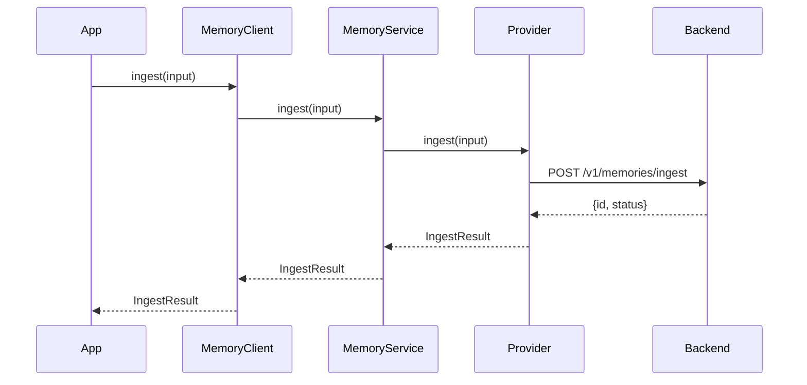

# Architecture

`MemoryClient` is a layered dispatcher. Application code talks to a single class; under the hood, routing and backend calls are separate concerns that compose cleanly.

## The layers

Solid arrows are the request path; dotted arrows are peer subsystems that applications compose directly via subpath exports.

| Layer | Responsibility | Source of truth |
|---|---|---|
| `MemoryClient` | Public surface. Config validation, lifecycle, facade for all memory operations. | `src/client/memory-client.ts` |
| `MemoryService` | Provider routing. Picks the right provider per operation, runs any op-level pipeline. | `src/memory/memory-service.ts` |
| `MemoryProvider` | Backend I/O. HTTP calls, mapping to/from wire format, declaring capabilities. | `src/memory/provider.ts` and per-provider directories |

`StorageManager` and `EmbeddingGenerator` are standalone subsystems reachable through the `./storage` and `./embedding` subpath exports. They run alongside `MemoryClient` when an application needs client-side persistence or local embeddings, and are independent of the memory backend.

## Ingest, end to end

Search follows the same shape. Every operation on `MemoryClient` delegates to `MemoryService`, which resolves the active provider and dispatches.

## Why layered

1. **Swappable backends.** `MemoryService` does not know the wire format. `MemoryProvider` does not know the operation-level pipeline. Each layer can change independently, which is what makes backend-agnosticism real and not aspirational.
2. **One integration seam.** Every backend implements `MemoryProvider`. Adding a new backend is a matter of subclassing `BaseMemoryProvider` and registering it.
3. **Testable in isolation.** Providers are tested against the `MemoryProvider` contract alone. The top-level `MemoryClient` has a thin integration layer and is tested mostly for lifecycle and routing.

## Where to go next

- [Provider model](/sdk/concepts/provider-model) — the `MemoryProvider` interface and the extension system
- [Scopes and identity](/sdk/concepts/scopes-and-identity) — the `Scope` shape every operation carries
- [Capabilities](/sdk/concepts/capabilities) — how to probe what a provider supports
