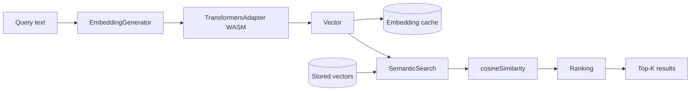

# Embeddings

The SDK ships **local** embedding generation through `@huggingface/transformers`. Applications can embed text in the browser, in a worker, or in Node — no API calls, no round trip, no per-token cost.

This is the `/embedding` subpath export. It's independent of `MemoryClient`; the top-level client does not use the embedding module directly (backends embed server-side). The `EmbeddingGenerator` exists for apps that want client-side semantic search over their own data.

## The pipeline



Text goes in, vectors come out, vectors get compared, ranked results come back. The model runs as WASM inside the browser or Node process; on first use it downloads from the Hugging Face CDN and caches in IndexedDB.

## Default model

`Xenova/all-MiniLM-L6-v2`, 384 dimensions, int8-quantized. This matches what `atomicmemory-core` uses when configured with the `transformers` embedding provider — so the same embeddings are comparable across client and server if you ever need to mix them.

You can override the model:

```typescript
import { EmbeddingGenerator } from '@atomicmemory/atomicmemory-sdk/embedding';

const generator = new EmbeddingGenerator({
  model: 'Xenova/all-MiniLM-L6-v2',
  dimensions: 384,
  provider: 'transformers',
});

const result = await generator.generateEmbedding('Hello world');
// result.embedding is a Float32Array of length 384
```

## Caching

First-call latency for a new model is dominated by download (~20 MB for the default) and compile. Subsequent calls in the same session are milliseconds. Across sessions, the ONNX weights are cached in IndexedDB by `transformers.js` itself; the SDK does not re-download.

The `cache-safety` helpers in `src/embedding/` guard against corrupted cache entries — they validate, repair, or re-download as needed.

## WASM loading

The default transformers.js build loads its WASM runtime from the CDN. For offline or strict-CSP environments, pin a local WASM path through the transformers.js `env` config before instantiating the generator. Feature detection in `src/embedding/feature-flags.ts` selects the appropriate execution path for the runtime (WebGPU where available, WASM otherwise).

## When you need this

- Client-side search over local data that never leaves the browser
- Query pre-filtering before sending to a remote backend
- Offline demos
- Combining embeddings from the same model as the server for consistency

If you're using `MemoryClient` with `atomicmemory-core` or Mem0, you probably do **not** need this module — the backend embeds for you.

## Next

- [Semantic search primitives](/sdk/guides/browser-primitives) — using `EmbeddingGenerator` with `SemanticSearch` for a full client-side pipeline
- [Storage adapters](/sdk/concepts/storage-adapters) — where the model cache and any stored vectors live
