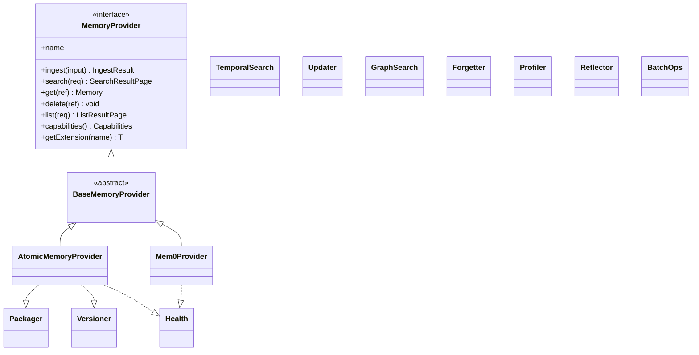
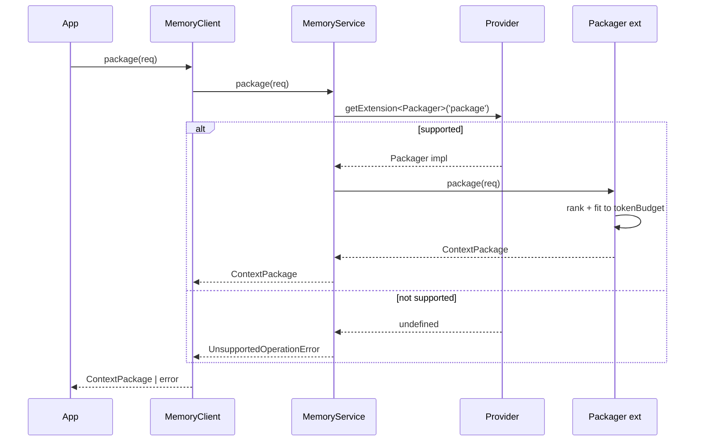

# Memory providers

> **Disambiguation.** On this page, "provider" means a **memory backend** — a concrete implementation of the `MemoryProvider` interface that `MemoryClient` routes operations through. Core's [providers](/platform/providers) page is about **embedding and LLM providers** inside the engine (OpenAI, Ollama, etc.). Different layer, different concept.

The provider model is what makes `MemoryClient` backend-agnostic. It has three pieces: an interface every backend implements, a registry the client consults at init time, and an extension system for backend-specific capabilities.

## The interface



Every backend implements the same six core operations: `ingest`, `search`, `get`, `delete`, `list`, `capabilities`. Beyond the core, the provider may opt into any of a fixed menu of **extensions** — `Packager`, `TemporalSearch`, `Versioner`, `Updater`, `GraphSearch`, `Forgetter`, `Profiler`, `Reflector`, `BatchOps`, `Health` — and declare which ones it supports through its `Capabilities` object.

This is why capabilities are runtime-queryable: an app that wants to use `memory.package()` must first check that the active provider supports the `package` extension, because not every backend does.

## The registry

Providers are instantiated at init time from the `providers` config. The registry (`src/memory/providers/registry.ts`) maps provider names to factory functions. The default registry includes `atomicmemory` and `mem0`:

```typescript
new MemoryClient({
  providers: {
    atomicmemory: { apiUrl: 'http://localhost:3050' },
    mem0: { apiUrl: 'http://localhost:8000' },
  },
  defaultProvider: 'atomicmemory',
});
```

`defaultProvider` names the provider every operation routes to unless overridden. When only one provider is configured, it is the default implicitly. A custom provider is registered the same way — see [Writing a custom provider](/sdk/guides/custom-provider).

## Extensions: the probe pattern

When an app calls `memory.package()`, `MemoryService` asks the active provider "do you implement the `package` extension?" via `getExtension('package')`:



The key is named after the **capability** (`'package'`), not the interface type (`Packager`). A provider either returns a value that satisfies the `Packager` interface or returns `undefined`, in which case `MemoryService` raises `UnsupportedOperationError`.

This design is deliberate: extensions are optional, but they are not second-class. Apps can use them freely as long as they check `capabilities()` first.

## Shipped providers

- **`AtomicMemoryProvider`** — HTTP client for `atomicmemory-core`. Implements the core operations plus `Packager`, `TemporalSearch`, `Versioner`, `Updater`, `Health`. See [Using the atomicmemory backend](/sdk/guides/atomicmemory-backend).
- **`Mem0Provider`** — HTTP client for Mem0. Implements core operations plus `Health`. See [Using the Mem0 backend](/sdk/guides/mem0-backend).

A third provider is always possible — you write it. See [Writing a custom provider](/sdk/guides/custom-provider).

## Next

- [Capabilities](/sdk/concepts/capabilities) — how to query what a provider supports before calling an extension
- [Scopes and identity](/sdk/concepts/scopes-and-identity) — the scope model every provider receives
