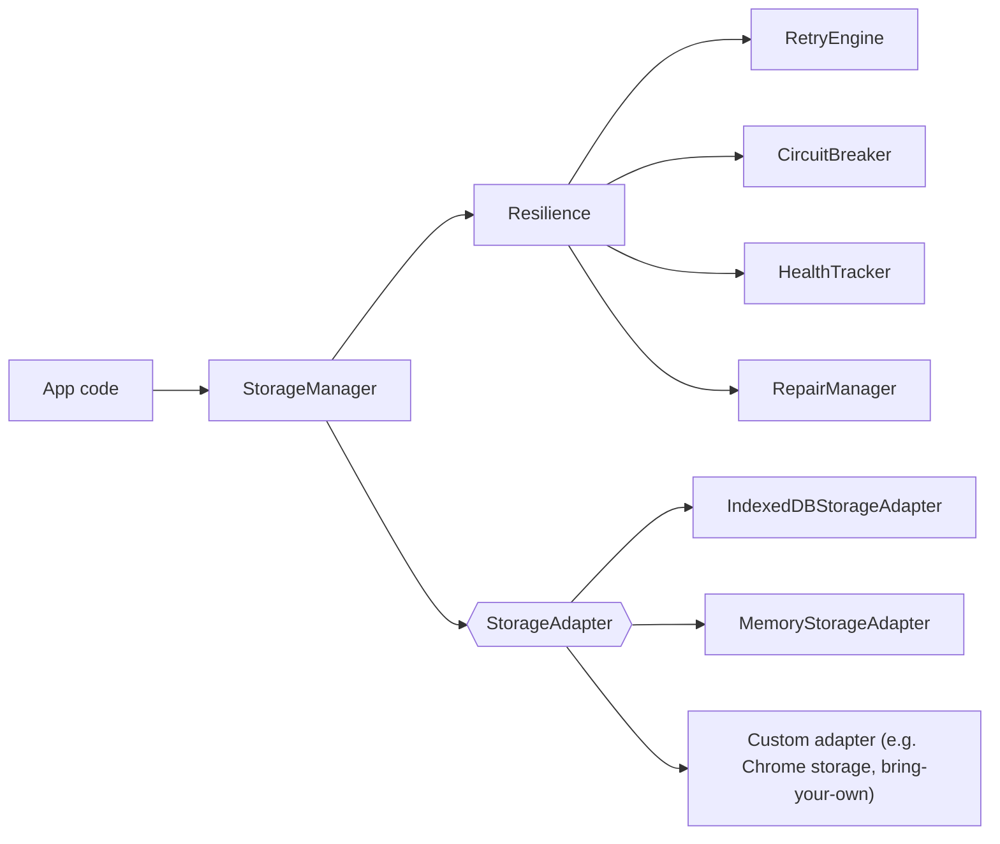

# Storage adapters

The SDK's storage subsystem is a thin, resilient abstraction over key-value storage. It lives behind the `/storage` subpath export and is intended for applications that need persistent client-side state — for example, to pair with the `/embedding` and `/search` primitives in a no-backend topology.

Storage is a separate concern from the memory **backend**. The backend holds your memories; storage holds local data — caches, application state, queued writes, bundled knowledge bases. `MemoryClient` does not use `StorageManager` internally.

## The subsystem



Three parts matter:

- **`StorageManager`** — the facade applications call. Handles validation, delegates to an adapter, runs the resilience stack.
- **`StorageAdapter` interface** — the contract a concrete storage mechanism implements. Six operations: `get`, `set`, `delete`, `clear`, `has`, `keys`, plus `batch` and `stats`.
- **Resilience layer** — retry, circuit breaker, health tracking, and corruption repair. These are on by default and can be tuned per deployment.

## Shipped adapters

The SDK exports two adapters out of the box:

| Adapter | When to use | Notes |
|---|---|---|
| **`IndexedDBStorageAdapter`** | Browser, browser extension | Native IndexedDB. Supports encryption, health checks, corruption repair. |
| **`MemoryStorageAdapter`** | Node.js, workers, tests | In-memory. Not persistent. Zero setup. |

```typescript
import {
  StorageManager,
  IndexedDBStorageAdapter,
} from '@atomicmemory/atomicmemory-sdk/storage';

const adapter = new IndexedDBStorageAdapter();
await adapter.initialize({ dbName: 'my-app-storage' });

const storage = new StorageManager([adapter]);
await storage.initialize();

await storage.set('preferences', { theme: 'dark' });
const prefs = await storage.get<{ theme: string }>('preferences');
```

## Chrome extensions and other targets

The SDK does **not** ship a `ChromeStorageAdapter`. Extension authors who want to back storage with `chrome.storage.local` implement the `StorageAdapter` interface themselves — the interface is small and the path is deliberate.

## Writing a custom adapter

The full interface is eight methods. Here's the minimum to implement:

```typescript
import type { StorageAdapter } from '@atomicmemory/atomicmemory-sdk/storage';

export class ChromeStorageAdapter implements StorageAdapter {
  async initialize() {}
  async get<T>(key: string): Promise<T | null> {
    const result = await chrome.storage.local.get(key);
    return (result[key] as T) ?? null;
  }
  async set<T>(key: string, value: T): Promise<void> {
    await chrome.storage.local.set({ [key]: value });
  }
  async delete(key: string): Promise<void> {
    await chrome.storage.local.remove(key);
  }
  async clear(): Promise<void> {
    await chrome.storage.local.clear();
  }
  async has(key: string): Promise<boolean> {
    const result = await chrome.storage.local.get(key);
    return key in result;
  }
  async keys(): Promise<string[]> {
    const all = await chrome.storage.local.get(null);
    return Object.keys(all);
  }
  async batch(operations): Promise<void> {
    // delegate per op
  }
  async stats() {
    return { keyCount: (await this.keys()).length };
  }
}
```

Plug it into `StorageManager` like any other adapter.

## Resilience: what is on by default

- **Retry** — transient failures (quota, transaction aborts) are retried with exponential backoff.
- **Circuit breaker** — sustained failures open the circuit; subsequent calls fail fast until the breaker half-opens and tests recovery.
- **Health tracking** — the manager tracks adapter health and emits events on degradation.
- **Repair** — detects corrupted entries in IndexedDB and attempts repair before falling back to an error.

All of this is opt-out, not opt-in. Applications that want stricter failure semantics can disable the resilience layer in favour of raw adapter calls.

## Next

- [Embeddings](/sdk/concepts/embeddings) — which uses IndexedDB under the hood for its model cache
- [Browser primitives](/sdk/guides/browser-primitives) — composing storage with embeddings and search outside `MemoryClient`
