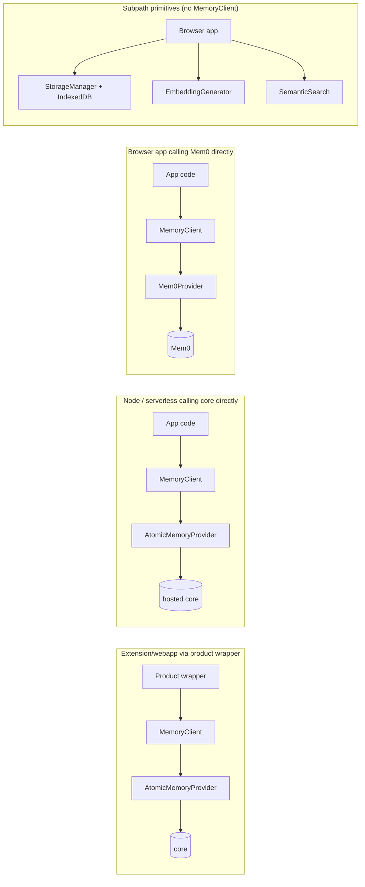

# SDK Overview

A TypeScript client for memory, pluggable across backends.

`@atomicmemory/atomicmemory-sdk` is a platform utility, not a framework. It gives application code a single, typed API for ingest, search, and context assembly, and it stays agnostic to which memory engine sits behind it. The same client can talk to a self-hosted `atomicmemory-core`, a Mem0 service, or a custom backend you wire yourself.

## Three-point value prop

- **Backend-agnostic via `MemoryProvider`.** Every operation routes through the `MemoryProvider` interface. Swap `atomicmemory-core` for Mem0 — or a provider you write — with a config change, not a rewrite. Apps inspect provider capabilities at runtime and gracefully degrade when a backend does not support an extension (packaging, temporal search, versioning, etc.).
- **Browser / extension / Node / worker-ready.** ESM + CJS dual build, subpath exports, and WASM-based local embeddings via `@huggingface/transformers`. The same package runs in a Chrome extension, a Next.js app, a serverless handler, or a web worker.
- **Client-side primitives for composition.** The `/storage`, `/embedding`, and `/search` subpath exports ship standalone — `StorageManager`, `EmbeddingGenerator`, `SemanticSearch`. You can compose memory features directly from these without ever constructing `MemoryClient`. The SDK is a bundle of reusable parts, not a single mandatory object.

## `MemoryClient` — the canonical public API

```ts
import { MemoryClient } from '@atomicmemory/atomicmemory-sdk';

const memory = new MemoryClient({
  providers: { atomicmemory: { apiUrl: 'http://localhost:3050' } },
});
await memory.initialize();

await memory.ingest({
  mode: 'messages',
  messages: [{ role: 'user', content: 'I prefer aisle seats.' }],
  scope: { user: 'u1' },
});

const results = await memory.search({
  query: 'seat preference',
  scope: { user: 'u1' },
});
```

`MemoryClient` composes a `MemoryService` under the hood and exposes the pure memory API: `ingest`, `search`, `package`, `get`, `list`, `delete`, plus `capabilities` / `getExtension` / `getProviderStatus` for capability inspection, and an `atomicmemory` getter that returns the full [AtomicMemory namespace handle](/sdk/api/memory-provider) (lifecycle, audit, lessons, config, agents). The surface is intentionally small — application-layer concerns such as identity resolution, capture policy, or injection gating belong in consumer code, not in the SDK.

## Deployment topologies



The first three topologies route through `MemoryClient`. The fourth composes the subpath exports directly — useful when you want client-side semantic search over your app's data without any backend at all. See [Browser primitives](/sdk/guides/browser-primitives).

## Browser-safe entry

For browser applications that talk to a backend-hosted core through `MemoryClient` and don't need on-device storage or embeddings, import from the `./browser` subpath — a slim bundle that omits `storage`, `embedding`, `search`, and `utils`:

```ts
import { MemoryClient } from '@atomicmemory/atomicmemory-sdk/browser';
```

## Where to go from here

- Run through the [Quickstart](/sdk/quickstart) for a 5-minute install and first call.
- Read the [Provider model](/sdk/concepts/provider-model) to understand how the backend-agnostic story works in detail.
- If you are looking for the memory engine itself — the server, the HTTP API, the claim schema — start at the [Core introduction](/).
